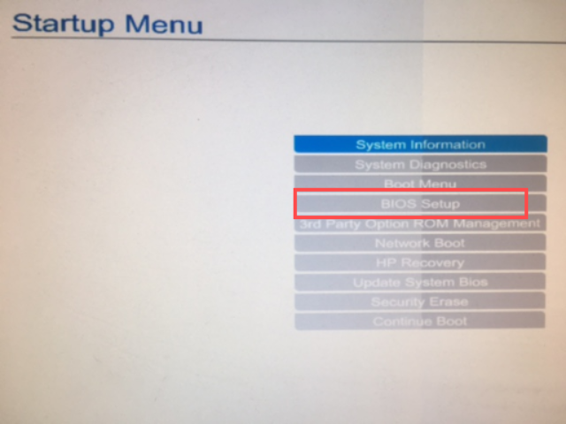
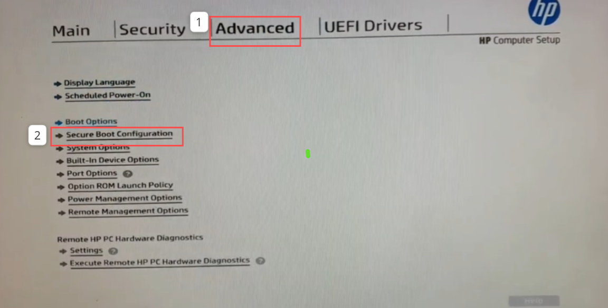
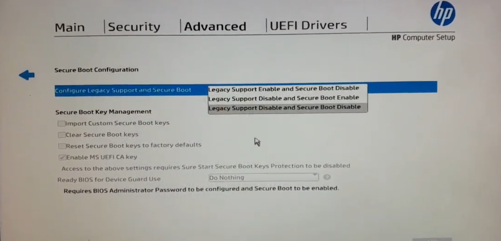
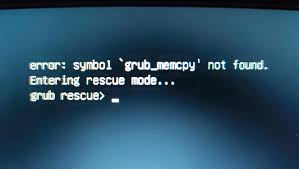
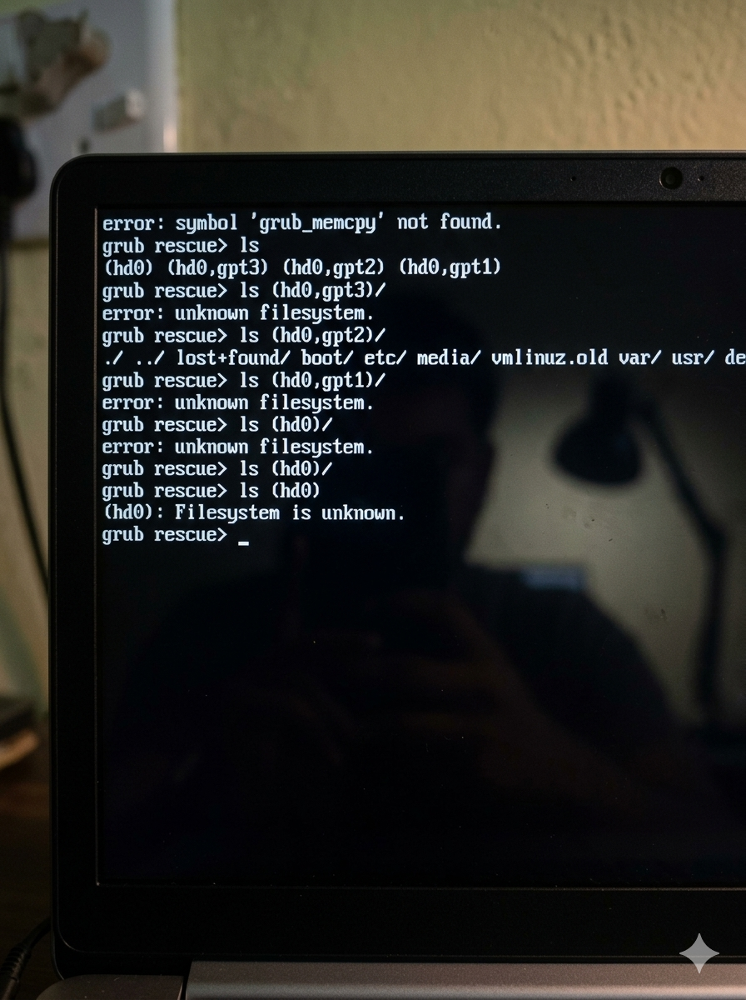
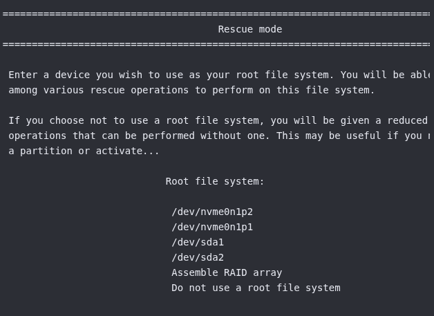
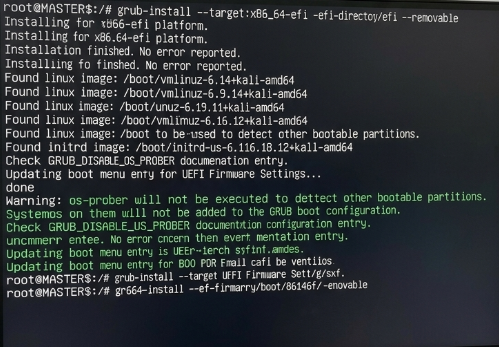

Please press Enter to attempt boot to next device

Heyyyy! guys M4ST3RS here again with another linux write up yeah,so if you are a linux nerd you definitely have come across this error message when booting your machine atleast once or twice 💔 while booting your PC. 
Well without any knowledge you might be tempted to re-install your OS then you might just run the risk of loosing the data on your current disk if not backed up properly.

So first of all  you need to know  `What is Secure boot?` 
Secure boot is the Security Standard that ensures your computer boots up using Software that is trusted only by your PC manufacturer (OEM).

So think of it like a digital Security guard at the entrance of the computer that checks the digital signature (ID) of every piece of startup software.

With that out of the way by now you already know what causes it and now let's go to the fix.
So it has two steps and we will cover both since you have to go through the first one to get to the second one.

# Step (1):
Shut down your PC and boot it up while you pres the `esc or f10` keys on your keyboard untill you see the info at the bottom left of your screen `Entering startup mode` to access the `BIOS` startup menu

Scroll down to the BIOS steup menu to access the Secure Boot configuration to modify the secure boot options after accessing the Advanced menu options as shown below

Toggle the Secure boot Configuration options arrow button to reveal a drop-down that gives you multiple options for the secure boot feature and select `Legacy Support Disable and Secure Boot Disable`

Use the `esc`key to go back Save changes and Exit.
Your PC should boot up normally.

## Step(2):

If you see the error on the top left of you screen it means  the `AppImage`(a portable Linux application format)is  broken.

So to bypass this grab you bootable USB stick with the ISO of your OS burned on it for this demo we will use `Kali linux ISO` 

Use the `ls ` command to list the partitions in the format `(hd0,gpt1)`
`ls(hd0,gpt1)/`
`ls(hd0,gpt2)`
`ls(hd30)/`
Follow the format above to list the partitions until one shows `bin/,boot/,etc/`

Expected output most will say :`error: unknown filesystem`

Now plug your USB stick and and restart PC to enter `BIOS`settings and boot from it .
When Kali menu appears select `Advanced options` and choose `Rescue mode`

**Select the Partition:** Use your arrow keys to highlight **`/dev/nvme0n1p2`** and press **Enter** 
Note: On modern SSDs, `nvme0n1p2` is the same as your earlier `gpt2`) for **my setup** 
You will see a command prompt (terminal) at the bottom
Type these exactly:
`grub-install /dev/nvme0n1` (Press Enter)
`update-grub` (Press Enter)
Another menu appears prompting you to either select **yes** or **No** select `yes` 
and continue

***ERROR*** :`EFI variables cannot be set` if you encounter this error which sometimes happens in rescue mode and might mean the computer still won't "see" the new bootloader automatically.

Follow along with the command as follows:
`grub-install --target=x86_64-efi --efi-directory=/boot/efi --removable`
 and type`exit`  and press **Enter**
 

`Abort the installation `

So yeah there you go you PC is back and no data is lost🙂